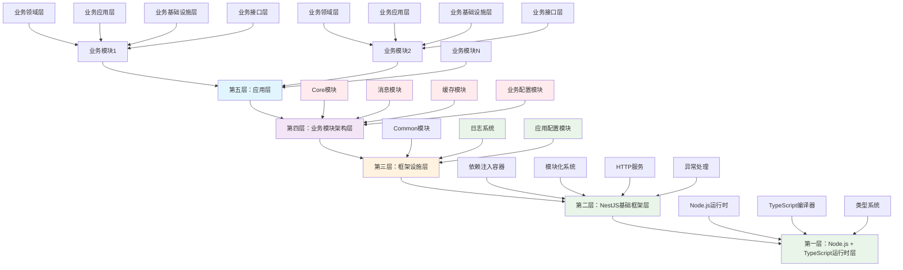

# HL8-SAAS 平台框架设计方案

## 📋 文档信息

- **文档标题**: HL8-SAAS 平台框架设计方案
- **文档版本**: 1.0.0
- **创建日期**: 2024-12-19
- **最后更新**: 2024-12-19
- **作者**: AI 助手
- **状态**: 设计阶段

## 🎯 设计目标

### 主要目标

1. **统一开发范式**: 为SAAS平台提供统一的开发范式和架构模式
2. **分层架构设计**: 采用由下至上的分层架构，每层职责清晰
3. **混合架构模式**: 整合Clean Architecture + CQRS + 事件溯源（ES）+ 事件驱动架构（EDA）
4. **可扩展性**: 支持业务模块的快速开发和扩展
5. **技术栈统一**: 基于Node.js + TypeScript + NestJS的技术栈

### 设计原则

- **分层原则**: 每层只依赖下层，不依赖上层
- **单一职责**: 每层只负责自己的核心职责
- **开闭原则**: 对扩展开放，对修改关闭
- **依赖倒置**: 高层模块不依赖低层模块，都依赖抽象
- **接口隔离**: 客户端不应该依赖它不需要的接口

## 🏗️ 架构分层设计

### 整体架构图



## 📚 第一层：Node.js + TypeScript 运行时层

### 职责描述

**最底层的基础运行时环境**，为整个SAAS平台提供运行时支持和开发语言支持。

### 核心组件

#### 1. Node.js 运行时

**职责**：

- 提供JavaScript运行时环境
- 提供异步I/O支持
- 提供模块系统支持
- 提供事件循环机制

**技术特性**：

- **异步非阻塞I/O**: 支持高并发处理
- **事件驱动**: 基于事件循环的编程模型
- **模块化**: 支持CommonJS和ES模块
- **跨平台**: 支持Windows、Linux、macOS

**版本要求**：

- Node.js >= 20.0.0
- 支持ES2022特性
- 支持原生ES模块

#### 2. TypeScript 类型系统

**职责**：

- 提供静态类型检查
- 提供类型推导和推断
- 提供接口和泛型支持
- 提供编译时错误检查

**技术特性**：

- **静态类型**: 编译时类型检查
- **类型推导**: 自动类型推断
- **接口系统**: 契约式编程支持
- **泛型支持**: 类型参数化
- **装饰器**: 元编程支持

**配置要求**：

- TypeScript >= 5.0.0
- 启用严格模式
- 启用装饰器支持
- 启用ES2022目标

#### 3. TypeScript 编译器

**职责**：

- 将TypeScript代码编译为JavaScript
- 提供类型检查
- 提供源码映射
- 提供增量编译

**技术特性**：

- **增量编译**: 只编译变更的文件
- **源码映射**: 调试支持
- **类型检查**: 编译时错误检查
- **模块解析**: 支持路径映射

### 设计原则

1. **运行时稳定性**: 确保Node.js运行时的稳定性和性能
2. **类型安全**: 利用TypeScript的类型系统确保代码质量
3. **开发效率**: 提供良好的开发体验和工具支持
4. **兼容性**: 确保与上层框架的兼容性

## 🚀 第二层：NestJS 基础框架层

### 职责描述

**基础开发框架层**，提供容器化、依赖注入、模块化能力，统一处理日志、异常处理、HTTP服务等横切关注点。

### 核心组件

#### 1. 依赖注入容器

**职责**：

- 管理对象的生命周期
- 提供依赖注入能力
- 支持单例和瞬态模式
- 支持作用域管理

**技术特性**：

- **IoC容器**: 控制反转容器
- **依赖注入**: 自动依赖解析
- **生命周期管理**: 对象创建和销毁
- **作用域支持**: 单例、瞬态、请求作用域

**设计模式**：

```typescript
@Injectable()
export class UserService {
  constructor(
    private readonly userRepository: IUserRepository,
    private readonly logger: ILoggerService
  ) {}
}
```

#### 2. 模块化系统

**职责**：

- 提供模块化组织能力
- 支持模块间依赖管理
- 提供模块配置能力
- 支持动态模块加载

**技术特性**：

- **模块装饰器**: @Module装饰器
- **模块导入**: 支持模块导入导出
- **动态模块**: 运行时模块配置
- **全局模块**: 全局可用模块

**设计模式**：

```typescript
@Module({
  imports: [DatabaseModule, LoggingModule],
  providers: [UserService, UserController],
  exports: [UserService]
})
export class UserModule {}
```

#### 3. HTTP服务

**职责**：

- 提供HTTP服务器能力
- 支持RESTful API
- 提供中间件支持
- 支持请求响应处理

**技术特性**：

- **Fastify适配器**: 通过@nestjs/platform-fastify适配器集成高性能HTTP服务器
- **适配器模式**: NestJS通过适配器模式支持多种HTTP服务器（默认Fastify）
- **路由系统**: 自动路由注册
- **中间件**: 请求处理管道
- **序列化**: 自动序列化响应

**设计模式**：

```typescript
// main.ts - 配置Fastify适配器
import { NestFactory } from '@nestjs/core';
import { FastifyAdapter, NestFastifyApplication } from '@nestjs/platform-fastify';

async function bootstrap() {
  const app = await NestFactory.create<NestFastifyApplication>(
    AppModule,
    new FastifyAdapter()
  );
  await app.listen(3000);
}

// 控制器使用
@Controller('users')
export class UserController {
  @Get(':id')
  async getUser(@Param('id') id: string) {
    return await this.userService.findById(id);
  }
}
```

#### 4. 日志系统适配器

**职责**：

- 提供日志系统的适配器支持
- 支持多种日志库的集成
- 提供日志配置能力

**技术特性**：

- **Pino适配器**: 通过nestjs-pino适配器集成高性能日志库
- **适配器模式**: NestJS通过适配器模式支持多种日志库（Winston、Pino等）
- **配置管理**: 日志级别、格式、输出等配置
- **性能优化**: 高性能日志记录

**设计模式**：

```typescript
// app.module.ts - 配置Pino适配器
import { LoggerModule } from 'nestjs-pino';

@Module({
  imports: [
    LoggerModule.forRoot({
      pinoHttp: {
        level: process.env.NODE_ENV !== 'production' ? 'debug' : 'info',
        transport: process.env.NODE_ENV !== 'production' 
          ? { target: 'pino-pretty' }
          : undefined,
      },
    }),
  ],
})
export class AppModule {}
```

#### 5. 异常处理

**职责**：

- 提供统一的异常处理
- 支持异常过滤器
- 提供错误响应格式化
- 支持异常日志记录

**技术特性**：

- **异常过滤器**: 全局异常处理
- **HTTP异常**: 标准HTTP状态码
- **错误响应**: 统一错误响应格式
- **异常日志**: 自动异常日志记录

**设计模式**：

```typescript
@Catch()
export class GlobalExceptionFilter implements ExceptionFilter {
  catch(exception: unknown, host: ArgumentsHost) {
    // 异常处理逻辑
  }
}
```

### 设计原则

1. **框架统一**: 基于NestJS提供统一的开发框架
2. **横切关注点**: 统一处理日志、异常、HTTP等横切关注点
3. **依赖注入**: 利用IoC容器管理对象依赖
4. **模块化**: 支持模块化开发和部署

## 🏛️ 第三层：框架设施层

### 职责描述

**框架设施层**，为业务模块的开发提供NestJS框架的横切关注点支持，包括装饰器、中间件、过滤器、守卫、日志系统、应用配置等通用组件，不涉及具体的业务架构模式实现。每个业务模块都基于此层进行开发。

### 核心组件

#### 1. Common模块

**职责**：

- 提供NestJS框架的横切关注点支持
- 提供通用的装饰器、中间件、过滤器、守卫等
- 提供统一的日志系统
- 提供通用的工具函数和类型定义
- 不涉及具体的业务架构模式实现

**技术特性**：

- **横切关注点**: 提供通用的NestJS横切关注点支持
- **装饰器系统**: 通用的NestJS装饰器（如多租户、性能监控等）
- **中间件系统**: 通用的请求处理中间件
- **异常过滤器**: 通用的异常处理过滤器
- **日志系统**: 统一的日志记录和管理
- **工具函数**: 通用的工具函数和类型定义

**架构分层**：

```
packages/common/src/
├── decorators/       # 通用装饰器系统
│   ├── multi-tenant/ # 多租户装饰器
│   ├── performance/  # 性能监控装饰器
│   └── validation/   # 验证装饰器
├── middleware/       # 通用中间件系统
│   ├── context/      # 上下文中间件
│   ├── performance/  # 性能监控中间件
│   └── security/     # 安全中间件
├── filters/          # 通用异常过滤器
├── guards/           # 通用守卫
├── interceptors/     # 通用拦截器
├── pipes/            # 通用管道
├── logging/          # 统一日志系统
│   ├── logger/       # 日志记录器
│   ├── formatters/   # 日志格式化器
│   ├── transports/   # 日志传输器
│   └── middleware/   # 日志中间件
├── providers/        # 通用提供者
├── types/            # 通用类型定义
└── utils/            # 通用工具函数
```

#### 2. 应用配置模块

**职责**：

- 提供应用级别的配置管理
- 支持多环境配置
- 提供配置热更新
- 支持配置加密和安全管理

**技术特性**：

- **多环境支持**: 开发、测试、生产环境配置
- **配置热更新**: 运行时配置更新
- **配置加密**: 敏感配置的加密存储
- **配置验证**: 配置项的类型和格式验证
- **系统参数配置**: 数据库连接、缓存配置、日志配置等

**架构分层**：

```
packages/app-config/src/
├── config/           # 配置定义
│   ├── database/     # 数据库配置
│   ├── cache/        # 缓存配置
│   ├── logging/      # 日志配置
│   └── security/     # 安全配置
├── providers/        # 配置提供者
├── validators/       # 配置验证器
├── encryptors/       # 配置加密器
└── types/            # 配置类型定义
```

### 混合架构模式

**重要说明**：混合架构模式（Clean Architecture + CQRS + ES + EDA）是业务模块的框架设计，每个业务模块内部都包含Core模块，Core模块提供这个混合架构模式的完整实现，业务模块通过继承和扩展Core模块的基类来实现具体的业务逻辑。

#### 1. Clean Architecture

**分层原则**：

- **领域层**: 最内层，包含业务逻辑
- **应用层**: 用例编排和业务规则
- **基础设施层**: 技术实现细节
- **接口层**: 用户交互接口

**依赖方向**：

```
接口层 → 应用层 → 领域层
  ↓        ↓        ↑
基础设施层 → 应用层 → 领域层
```

#### 2. CQRS (命令查询职责分离)

**命令端**：

- 处理写操作
- 产生领域事件
- 更新聚合状态

**查询端**：

- 处理读操作
- 优化查询性能
- 提供读模型

#### 3. Event Sourcing (事件溯源)

**事件存储**：

- 记录所有业务状态变更
- 支持事件重放
- 提供审计追踪

**状态重建**：

- 从事件历史重建当前状态
- 支持快照机制
- 支持版本控制

#### 4. Event-Driven Architecture (事件驱动架构)

**事件发布**：

- 异步事件发布
- 事件路由和分发
- 事件持久化

**事件处理**：

- 事件处理器
- 事件投影器
- 事件补偿

### 设计原则

1. **架构统一**: 为所有业务模块提供统一的架构模式
2. **职责分离**: 清晰的分层和职责划分
3. **事件驱动**: 基于事件的松耦合设计
4. **可扩展性**: 支持业务模块的快速扩展

## 🏗️ 第四层：业务模块架构层

### 职责描述

**业务模块架构层**，为业务模块提供统一的架构基础设施，包括Core模块、消息模块、缓存模块、统一配置模块等，为业务模块提供混合架构模式支持和通用业务组件。

### 核心组件

#### 1. Core模块

**职责**：

- 提供混合架构模式框架设计：Clean Architecture + CQRS + 事件溯源（ES）+ 事件驱动架构（EDA）
- 提供领域层、应用层、基础设施层、接口层的基础抽象类
- 提供业务通用组件：多租户支持、权限管理、审计追踪等
- 为业务模块提供统一的架构基类和工具

**技术特性**：

- **混合架构模式**: 完整实现Clean Architecture + CQRS + ES + EDA的混合架构
- **架构基类**: 提供领域实体、聚合根、命令处理器、查询处理器等基础实现
- **业务通用组件**: 提供多租户、权限管理、审计追踪等通用业务功能
- **统一规范**: 确保所有业务模块遵循相同的架构模式和编码规范

#### 2. 消息模块

**职责**：

- 提供统一的消息队列服务
- 支持事件驱动架构的消息传递
- 提供消息路由和分发能力
- 支持消息持久化和重试机制

**技术特性**：

- **消息队列**: 支持多种消息队列实现（Redis、RabbitMQ、Kafka等）
- **事件路由**: 基于事件类型的消息路由
- **消息持久化**: 消息的持久化存储和恢复
- **重试机制**: 失败消息的自动重试

#### 3. 缓存模块

**职责**：

- 提供统一的缓存服务
- 支持多级缓存策略
- 提供缓存失效和更新机制
- 支持分布式缓存

**技术特性**：

- **多级缓存**: 内存缓存 + 分布式缓存
- **缓存策略**: LRU、TTL、写回等缓存策略
- **缓存失效**: 基于事件的缓存失效机制
- **分布式缓存**: 支持Redis等分布式缓存

#### 4. 业务配置模块

**职责**：

- 提供业务级别的配置管理
- 支持业务功能配置
- 提供租户级配置管理
- 支持业务规则配置

**技术特性**：

- **业务参数配置**: 业务模块的功能开关、参数配置等
- **租户级配置**: 多租户环境下的租户特定配置
- **业务规则配置**: 业务规则、工作流配置等
- **配置继承**: 支持配置的继承和覆盖机制
- **动态配置**: 支持业务配置的动态更新

### 设计原则

1. **架构统一**: 为所有业务模块提供统一的架构基础设施
2. **组件复用**: 提供可复用的业务通用组件
3. **松耦合**: 各模块间通过接口进行交互
4. **可扩展性**: 支持业务模块的快速扩展

## 🎯 第五层：应用层

### 职责描述

**应用层**，由业务模块组成，每个业务模块都基于第三层的框架设施层和第四层的业务模块架构层进行开发。业务模块通过使用第三层提供的应用配置模块、日志系统等，以及第四层提供的Core模块、消息模块、缓存模块、业务配置模块等，实现具体的业务功能，确保所有业务模块遵循统一的架构原则。

### 核心组件

#### 1. 业务模块

**职责**：

- 实现具体业务功能
- 基于第三层框架设施层提供的应用配置模块、日志系统等，以及第四层业务模块架构层提供的Core模块、消息模块、缓存模块、业务配置模块等
- 通过继承和扩展Core模块的基类实现业务逻辑
- 使用消息模块、缓存模块等通用组件
- 提供业务API接口

**技术特性**：

- **架构基础设施**: 基于第三层提供的应用配置模块、日志系统等，以及第四层提供的Core模块、消息模块、缓存模块、业务配置模块
- **混合架构模式**: 使用Core模块提供的Clean Architecture + CQRS + ES + EDA框架设计
- **继承扩展**: 通过继承Core模块的基类实现业务逻辑，确保架构一致性
- **通用组件**: 使用应用配置模块、日志系统、消息模块、缓存模块、业务配置模块等通用组件
- **模块化**: 独立的业务模块
- **可插拔**: 支持模块的插拔
- **可扩展**: 支持功能扩展
- **可测试**: 支持单元测试和集成测试

**模块示例**：

```
apps/
├── user-management/     # 用户管理模块
│   ├── domain/         # 业务领域层
│   ├── application/    # 业务应用层
│   ├── infrastructure/ # 业务基础设施层
│   └── interfaces/     # 业务接口层
├── tenant-management/   # 租户管理模块
├── permission-management/ # 权限管理模块
├── notification/        # 通知模块
├── audit/              # 审计模块
└── reporting/          # 报表模块
```

**依赖关系**：

```
业务模块
├── 依赖第四层：业务模块架构层
│   ├── Core模块（混合架构模式框架设计）
│   ├── 消息模块（消息队列服务）
│   ├── 缓存模块（缓存服务）
│   └── 业务配置模块（业务参数配置）
└── 依赖第三层：框架设施层
    ├── Common模块（NestJS横切关注点支持）
    ├── 日志系统（统一日志记录和管理）
    └── 应用配置模块（系统参数配置）
```

**业务模块开发示例**：

```typescript
// 用户管理模块 - 使用第四层业务模块架构层提供的组件
import { 
  BaseCommandHandler, 
  BaseQueryHandler, 
  BaseEntity
} from '@aiofix/core'; // 第四层Core模块

import { 
  MultiTenantService,
  PermissionService
} from '@aiofix/core'; // 第四层Core模块的业务通用组件

import { CacheService } from '@aiofix/cache'; // 第四层缓存模块
import { MessageService } from '@aiofix/messaging'; // 第四层消息模块
import { AppConfigService } from '@aiofix/app-config'; // 第三层应用配置模块
import { BusinessConfigService } from '@aiofix/business-config'; // 第四层业务配置模块
import { LoggerService } from '@aiofix/common'; // 第三层日志系统

// 继承Core模块的领域实体基类
export class User extends BaseEntity {
  constructor(
    id: string,
    private name: string,
    private email: string,
    private tenantId: string
  ) {
    super(id);
  }
}

// 继承Core模块的命令处理器基类
export class CreateUserCommandHandler extends BaseCommandHandler<CreateUserCommand> {
  constructor(
    private multiTenantService: MultiTenantService,
    private permissionService: PermissionService,
    private cacheService: CacheService,
    private appConfigService: AppConfigService,
    private businessConfigService: BusinessConfigService,
    private logger: LoggerService
  ) {
    super();
  }

  async execute(command: CreateUserCommand): Promise<void> {
    this.logger.log('Creating user', { userId: command.id, tenantId: command.tenantId });
    
    // 使用应用配置模块获取系统配置
    const dbConfig = await this.appConfigService.getDatabaseConfig();
    const cacheConfig = await this.appConfigService.getCacheConfig();
    
    // 使用业务配置模块获取业务规则
    const userCreationRules = await this.businessConfigService.getUserCreationRules(command.tenantId);
    const defaultPermissions = await this.businessConfigService.getDefaultPermissions(command.tenantId);
    
    // 使用Core模块的多租户服务
    await this.multiTenantService.validateTenant(command.tenantId);
    
    const user = new User(command.id, command.name, command.email, command.tenantId);
    await this.repository.save(user);
    
    // 使用Core模块的缓存服务
    await this.cacheService.set(`user:${user.id}`, user);
    
    // 使用Core模块的权限服务
    await this.permissionService.assignDefaultPermissions(user.id);
    
    this.logger.log('User created successfully', { userId: user.id });
    await this.eventBus.publish(new UserCreatedEvent(user.id, user.name));
  }
}

// 继承Core模块的查询处理器基类
export class GetUserQueryHandler extends BaseQueryHandler<GetUserQuery, User> {
  constructor(
    private cacheService: CacheService,
    private logger: LoggerService
  ) {
    super();
  }

  async execute(query: GetUserQuery): Promise<User> {
    this.logger.log('Getting user', { userId: query.userId });
    
    // 使用Core模块的缓存服务
    const cachedUser = await this.cacheService.get(`user:${query.userId}`);
    if (cachedUser) {
      this.logger.log('User found in cache', { userId: query.userId });
      return cachedUser;
    }
    
    const user = await this.repository.findById(query.userId);
    await this.cacheService.set(`user:${user.id}`, user);
    
    this.logger.log('User retrieved from database', { userId: user.id });
    return user;
  }
}
```

#### 2. 模块间通信

**职责**：

- 提供模块间通信机制
- 支持事件驱动通信
- 提供API调用支持
- 支持数据共享

**技术特性**：

- **事件总线**: 基于事件的通信
- **API网关**: 统一API入口
- **服务发现**: 服务注册和发现
- **负载均衡**: 请求分发和负载均衡

#### 3. 数据管理

**职责**：

- 提供数据访问能力
- 支持数据隔离
- 提供数据备份
- 支持数据迁移

**技术特性**：

- **多租户数据隔离**: 租户级数据隔离
- **数据分片**: 支持数据分片
- **数据备份**: 自动数据备份
- **数据迁移**: 支持数据迁移

### 设计原则

1. **业务导向**: 以业务需求为导向进行模块设计
2. **模块独立**: 每个业务模块相对独立
3. **接口统一**: 统一的模块接口规范
4. **可维护性**: 支持模块的独立维护和升级

## 🔄 层间交互设计

### 交互原则

1. **单向依赖**: 上层依赖下层，下层不依赖上层
2. **接口隔离**: 通过接口进行层间交互
3. **事件驱动**: 支持基于事件的异步交互
4. **错误处理**: 统一的错误处理和传播机制

### 交互模式

#### 1. 同步调用

```typescript
// 应用层调用业务架构层
const user = await this.userService.createUser(userData);

// 业务架构层调用NestJS框架层
this.logger.log('User created', { userId: user.id });

// NestJS框架层调用运行时层
console.log('Processing request');
```

#### 2. 异步事件

```typescript
// 业务架构层发布事件
await this.eventBus.publish(new UserCreatedEvent(user.id, user.name));

// 其他模块订阅事件
@EventHandler(UserCreatedEvent)
async handleUserCreated(event: UserCreatedEvent) {
  // 处理用户创建事件
}
```

#### 3. 依赖注入

```typescript
// NestJS框架层提供依赖注入
@Injectable()
export class UserService {
  constructor(
    private readonly userRepository: IUserRepository, // 来自业务架构层
    private readonly logger: ILoggerService // 来自NestJS框架层
  ) {}
}
```

## 📊 技术栈总结

### 运行时层

- **Node.js**: >= 18.0.0
- **TypeScript**: >= 5.0.0
- **ES2022**: 现代JavaScript特性

### 框架层

- **NestJS**: >= 10.0.0
- **@nestjs/platform-fastify**: Fastify适配器
- **nestjs-pino**: Pino日志适配器
- **Class Validator**: 数据验证
- **Class Transformer**: 数据转换

### 框架设施层

- **Common模块**: NestJS横切关注点支持
- **装饰器系统**: 多租户、性能监控、验证装饰器
- **中间件系统**: 上下文、性能监控、安全中间件
- **异常过滤器**: 统一异常处理
- **日志系统**: 统一日志记录和管理
- **应用配置模块**: 系统参数配置（数据库、缓存、日志等配置）
- **工具函数**: 通用工具函数和类型定义

### 业务模块架构层

- **Core模块**: 混合架构模式框架设计（Clean Architecture + CQRS + ES + EDA）
- **消息模块**: 消息队列服务（Redis、RabbitMQ、Kafka等）
- **缓存模块**: 缓存服务（多级缓存、分布式缓存）
- **业务配置模块**: 业务参数配置（业务规则、租户配置等）

### 应用层

- **业务模块**: 具体业务实现
- **MikroORM**: 对象关系映射
- **PostgreSQL**: 关系型数据库
- **MongoDB**: 文档数据库
- **Redis**: 缓存和消息队列
- **API Gateway**: API网关
- **Service Mesh**: 服务网格
- **Monitoring**: 监控和日志

## 🎯 实施计划

### Phase 1: 基础架构搭建

1. 搭建Node.js + TypeScript环境
2. 配置NestJS基础框架
3. 实现基础横切关注点

### Phase 2: 框架设施层开发

1. 开发Common模块
2. 实现NestJS横切关注点支持
3. 提供通用装饰器、中间件、过滤器等
4. 开发应用配置模块（系统参数配置）

### Phase 3: 业务模块架构层开发

1. 开发Core模块（混合架构模式框架设计）
2. 开发消息模块（消息队列服务）
3. 开发缓存模块（缓存服务）
4. 开发业务配置模块（业务参数配置）

### Phase 4: 应用层开发

1. 开发业务模块
2. 实现模块间通信
3. 集成测试和部署

### Phase 5: 优化和扩展

1. 性能优化
2. 功能扩展
3. 监控和运维

## 📚 参考资料

### 架构模式

- [Clean Architecture](https://blog.cleancoder.com/uncle-bob/2012/08/13/the-clean-architecture.html)
- [CQRS Pattern](https://docs.microsoft.com/en-us/azure/architecture/patterns/cqrs)
- [Event Sourcing](https://martinfowler.com/eaaDev/EventSourcing.html)
- [Event-Driven Architecture](https://martinfowler.com/articles/201701-event-driven.html)

### 技术文档

- [NestJS Documentation](https://docs.nestjs.com/)
- [TypeScript Handbook](https://www.typescriptlang.org/docs/)
- [Node.js Documentation](https://nodejs.org/docs/)

### 最佳实践

- [Domain-Driven Design](https://martinfowler.com/bliki/DomainDrivenDesign.html)
- [Microservices Patterns](https://microservices.io/)
- [12-Factor App](https://12factor.net/)

---

**文档状态**: 设计完成，等待评审和批准

**下一步行动**:

1. 技术评审
2. 架构评审
3. 实施计划确认
4. 开始Phase 1实施
